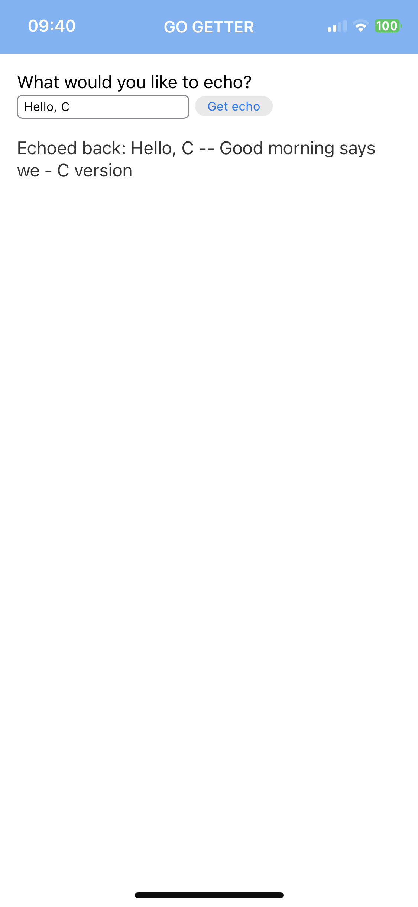
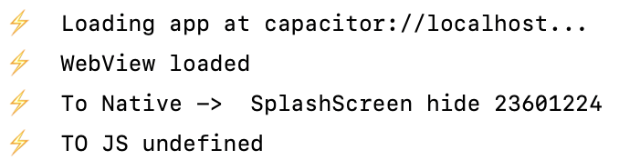
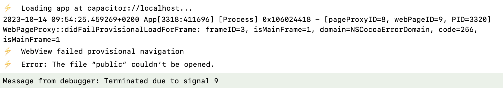

# Example app to show issue with Go static lib in Capacitor

Example app to show how a Capacitor plugin with a simple Go library cross-compiled to C
prevents the webview from loading.

The root of this app is the plugin repository. The demo app that consumes the plugin
is at `./example`.

## To replicate the bug

Clone the repo:

    git clone git@github.com:alex-steinberg/capacitor-plugin-c-go-static-libraries.git
    
    cd capacitor-plugin-c-go-static-libraries
   
Install plugin dependencies:

    npm install

Install example app dependencies:

    cd example

    npm install

Build web files:

    npm run build

Update iOS project:

    npx cap sync ios

Open Xcode:

    npx cap open ios

👉 Update signing, plug in your mobile phone and run the app.

### C library that works

When the app loads, enter text and tap 'Get echo'. The text that is returned
comes from the C library.

The console output in Xcode should look something like this:

This was the control. Let's look at the Go experiment.

### Go library that doesn't work

This will require Go installed on your system. Check by running `go version`.

If it's not installed, install it [here](https://go.dev/doc/install).

Now that Go is installed, we'll build the Go files as a C binary with our script.

From the example app root, go to the Go plugin source and build the Go binary:

    cd ../golib

    ./go-ios-build.sh

Reinstall the plugin cocoapod:

    cd ../ios/Plugin

    pod install

Go back to the example app and update the ios project with the new binary:

    cd ../example

    npx cap sync ios

Go back to Xcode and run the project.

The app should remain blank, and the console output in Xcode should look something like:

Comparing this console output to the one before reveals that the app has failed to load
the webview. Presumably, there has been an issue loading the Go library such then when the
webview loads and tries to communicate with the Go library, the process fails.

## FAQs

### Where does the inspiration for this example app come from?

We have a Capacitor MVP in production that embeds a Go library. It's on Capacitor v3
and builds and runs successfully, using macOS Ventura and Xcode 14.1. When attempting to upgrade
to Capacitor 5, the same problem illustrated in this app occurs. Android has no issues.

### Could the newer iOS SDKs be the issue?

Since Capacitor v3 targets a [fairly old](https://capacitorjs.com/docs/updating/3-0#ios) iOS
version (requires Xcode 12+) and Capacitor v5 [targets](https://capacitorjs.com/docs/updating/5-0#upgrade-xcode)
a newer version (requires Xcode 14.1+), there has likely been a change on either iOS
and/or Capacitor that is causing this issue.

### The size of the Go binary is 2,5mb and the C library is < 1kb. Could this be an issue?

The best current theory is that the larger Go library leads to a race condition that was
buried by all the other stuff going on in the production app (dozens of Capacitor plugins),
but is exposed by this simple example app that has no extra plugins, not to mention a tiny
frontend / webview.